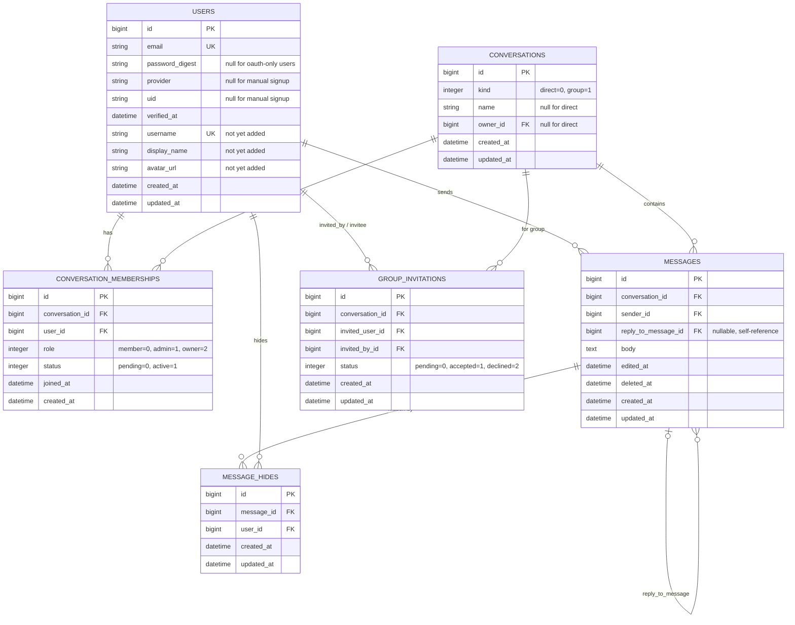

# PikotChat — Technical Specification

**Version:** 2.0
**Author:** sidney
**Date:** September 15, 2026
**Status:** Revised — realigned with the implemented API/web-split architecture

---

## 1. Overview

PikotChat is a real-time messaging application. Authenticated users can send direct messages to other users, create and manage group chats, invite other users into group chats (subject to the invited user's approval), and search for other users. Unauthenticated visitors are redirected to a login/registration flow. Registration supports both manual (email/password) and social sign-on.

The backend is a **standalone JSON API** with no view layer or server-rendered HTML. The web frontend is a separate static HTML/CSS/JS client that consumes it. This split is deliberate: the near-term deliverable is the web client, but the API itself is being built as the one and only backend for a **future native mobile client**, so it needs to stay client-agnostic from day one rather than accreting browser-specific assumptions (session cookies, server-rendered redirects, HTML error pages) that would have to be unwound later.

### 1.1 Architectural decisions (supersedes v1.0's assumptions)

v1.0 of this spec assumed a Devise-based Rails monolith with server-rendered ERB views. That was never built; what exists today is a different (and, for the stated mobile goal, better-suited) architecture. This revision documents what's actually in place and the reasoning, rather than a still-unbuilt alternative.

| Area | Decision | Why |
|---|---|---|
| Backend/frontend split | **API-only Rails backend** (`backend/`, `ActionController::API`) + **separate static web frontend** (`frontend/`, no build step, no framework), talking only over HTTP/JSON (and later WebSocket) | Keeps the API the single source of truth for both clients. A mobile app becomes a second consumer of the same endpoints instead of triggering a backend rewrite. |
| Auth transport | **Stateless JWT bearer tokens** (`Authorization: Bearer <token>`, `app/lib/json_web_token.rb`), not cookie/session-based | Mobile apps don't carry a browser cookie jar the way a web client does; a bearer token works identically for both, so there's no auth fork between clients. |
| Real-time transport | **Action Cable**, backed by **Redis** | Deliberately reintroduces Redis (rather than the Postgres-backed Solid Cable default) as the Action Cable adapter — a dedicated in-memory pub/sub is the better fit as message volume grows, and it's worth having Redis in the stack for a portfolio project either way. |
| Background jobs | **Solid Queue** (Postgres-backed), not Sidekiq/Redis | Unrelated to the real-time decision above — background jobs stay on the Solid Stack; only Action Cable's transport uses Redis. |
| Social login providers | **Facebook, LinkedIn, Apple** (OmniAuth), not Google/GitHub/LinkedIn | Reflects what KAN-7 actually wired up. Facebook Login also covers Instagram-linked accounts, which was the actual product ask. |
| Feature scope | **Text messages only** for v1 — no attachments, read receipts, or reactions | Unchanged from v1.0; still matches what's in [Future Enhancements](#14-future-enhancements). |
| Deployment scope | **Docker Compose for local development only** | Unchanged. Kamal scaffolding exists (`backend/config/deploy.yml`) but is unexercised — no production infra yet. |
| Web frontend rendering | **Static HTML + vanilla JS**, no framework, no build step, no jQuery/Tailwind | Matches what's actually in `frontend/`. All backend calls funnel through a single `Api` object (`frontend/js/api.js`) — the same discipline that makes swapping in (or adding) a mobile client straightforward, since there's already exactly one place that knows how to talk to the API. |

### 1.2 In scope

- Manual registration/login (email + password), stateless JWT sessions
- Social registration/login via Facebook, LinkedIn, and Apple (OmniAuth)
- A JSON API designed to be **client-agnostic**: no HTML rendering, no assumptions baked in that only hold for a browser (see [1.4](#14-mobile-readiness-notes))
- Direct (1:1) messaging
- Message create / edit / soft-delete
- Group chat create / edit / delete
- Inviting users to a group chat, with the invited user's explicit approval required before they're added
- Removing/leaving a group chat
- User search
- Real-time delivery of new messages and group invitations
- Authorization: every messaging/group action requires authentication; unauthenticated API requests get a `401` JSON response (there is no HTML login page to redirect to — the *web* client is what redirects to its own login screen on a `401`)

### 1.3 Out of scope (v1)

- The mobile client itself — only the API is being kept mobile-ready; building the mobile app is a later, separate effort
- File/image attachments
- Read receipts, typing indicators, reactions
- Push notifications (mobile/browser)
- Blocking/muting users
- Admin dashboard
- Production infrastructure/CI-CD (deployment specifics)

### 1.4 Mobile-readiness notes

Concrete things this spec commits to now, specifically so adding a mobile client later doesn't force API changes:

- **No server-rendered HTML anywhere in the API.** Every response is JSON, including errors (`{ "error": "..." }` / `{ "errors": [...] }`), so a mobile client never has to special-case an HTML page it can't render.
- **Auth is bearer-token, not cookie-based**, for the manual email/password flow and for authenticated requests generally — this already works identically for a native client.
- **The OmniAuth social-login flow is the one part that's currently web-shaped** and will need revisiting before a mobile client can use it: `omniauth-rails_csrf_protection` currently relies on a browser session cookie to protect the callback (see [6.2](#62-social-login)), and the redirect-based provider handshake assumes a browser. The common mobile pattern (system-browser handoff + custom URL scheme, or provider-native SDKs) is a deliberate deferral, not an oversight — called out here so it isn't forgotten when mobile work starts.
- **No API versioning prefix exists yet** (routes are unprefixed — `/signup`, `/login`, etc.). This is fine while there's a single web client under active development, but before a mobile client ships, introducing `/api/v1/...` (or an `Accept`/header-based scheme) is worth doing deliberately rather than retrofitting under pressure — flagged in [7](#7-api--route-design), not yet acted on.
- **CORS is currently scoped to one browser origin** (`FRONTEND_ORIGIN`, `backend/config/initializers/cors.rb`). This is irrelevant to native mobile clients (they don't go through CORS), so needs no change for mobile — worth noting so it isn't mistaken for a mobile blocker.

---

## 2. Tech Stack

| Layer | Choice |
|---|---|
| Language / Framework | Ruby 4.0.6 + Rails 8.1, **API-only** (`ActionController::API`, no view layer) |
| Database | PostgreSQL 18 |
| Real-time | Action Cable, **Redis** adapter (`redis` gem, `config/cable.yml`) |
| Background jobs | **Solid Queue** (Postgres-backed, no Sidekiq) |
| Cache | **Solid Cache** (Postgres-backed) |
| Auth | Custom `has_secure_password` + hand-rolled stateless JWT sessions (`app/lib/json_web_token.rb`); OmniAuth for social login (Facebook, LinkedIn, Apple) |
| Authorization | Plain Ruby checks inside service objects/controllers — no authorization gem yet. Revisit (e.g. Pundit) only if messaging/group permission logic outgrows ad-hoc checks; not assumed up front. |
| Web frontend | Static HTML + CSS + vanilla JavaScript, no build step, no framework — `frontend/` |
| Mobile client | Not yet built. The API is designed so it can become a second consumer later (see [1.4](#14-mobile-readiness-notes)) — out of scope for this document otherwise. |
| Pagination | Not yet decided (Pagy, or a hand-rolled keyset/cursor scheme — see [13](#13-cross-cutting-concerns)) |
| Testing | RSpec + FactoryBot. Request specs cover controller→service wiring and JSON shape; no Capybara/system-spec layer, since there are no server-rendered views to drive through a browser (see [12](#12-testing-strategy)) |
| Containerization | Docker + Docker Compose — three services: `db`, `backend`, `frontend` (nginx serving the static files) |
| Code quality | RuboCop (`rubocop-rails-omakase`), Brakeman, bundler-audit — `bin/ci` |

---

## 3. High-Level Architecture

```
        ┌───────────────────┐          ┌───────────────────────────┐
        │   Web Browser      │          │   Future Mobile Client     │
        │  Static HTML/CSS/JS │          │  (native iOS/Android)      │
        │  frontend/js/api.js │          │  same JSON contract        │
        └──────────┬─────────┘          └──────────────┬─────────────┘
                   │ HTTP (JSON) + WebSocket                             │ HTTP (JSON) + WebSocket
                   └─────────────────────┬───────────────────────────────┘
                                          ▼
                          ┌───────────────────────────────┐
                          │      Rails API (backend/)       │
                          │  Controllers (thin, JSON only)  │
                          │  ── delegate to ──►              │
                          │  app/services (business logic,   │
                          │  the "fat" layer)                │
                          │  Channels (Action Cable)         │
                          │  Auth: JWT bearer tokens          │
                          └────────┬──────────┬────────────┘
                                   │          │
                        ┌──────────▼──┐  ┌────▼─────────┐
                        │  PostgreSQL  │  │    Redis      │
                        │ system of    │  │ Action Cable   │
                        │ record +     │  │ pub/sub only   │
                        │ Solid Queue/ │  │                │
                        │ Cache        │  │                │
                        └──────────────┘  └────────────────┘
```

Both clients hit the exact same endpoints and get the exact same JSON — the web frontend has no privileged access the mobile client wouldn't also have. Controllers stay thin: they authenticate (`authenticate_request!`), parse params, call one service object, and render JSON. All business logic lives in `app/services` (see [Section 8](#8-service-layer-pattern)).

---

## 4. Directory Structure

```
pikot-messaging-app/
├── backend/                          # Rails 8.1 API-only app
│   ├── app/
│   │   ├── channels/
│   │   │   ├── application_cable/
│   │   │   ├── conversation_channel.rb       # per-conversation message stream (planned)
│   │   │   └── notifications_channel.rb      # per-user stream (planned)
│   │   ├── controllers/
│   │   │   ├── application_controller.rb     # authenticate_request!
│   │   │   ├── registrations_controller.rb
│   │   │   ├── sessions_controller.rb
│   │   │   ├── email_verifications_controller.rb
│   │   │   ├── omniauth_callbacks_controller.rb
│   │   │   ├── csrf_tokens_controller.rb
│   │   │   ├── users_controller.rb           # search (planned)
│   │   │   ├── conversations_controller.rb   # (planned)
│   │   │   ├── messages_controller.rb        # (planned)
│   │   │   └── groupchats_controller.rb      # (planned)
│   │   ├── models/
│   │   │   ├── user.rb
│   │   │   ├── conversation.rb               # (planned)
│   │   │   ├── conversation_membership.rb    # (planned)
│   │   │   ├── message.rb                    # (planned)
│   │   │   └── group_invitation.rb           # (planned)
│   │   ├── services/
│   │   │   ├── application_service.rb        # .call → new.call convention
│   │   │   ├── user_serializer.rb
│   │   │   ├── auth/
│   │   │   │   ├── user_registrar.rb
│   │   │   │   ├── password_authenticator.rb
│   │   │   │   ├── omniauth_authenticator.rb
│   │   │   │   └── session_issuer.rb
│   │   │   ├── users/
│   │   │   │   └── search_service.rb         # (planned)
│   │   │   ├── messages/                     # (planned)
│   │   │   ├── conversations/                # (planned)
│   │   │   └── groupchats/                   # (planned)
│   │   ├── mailers/
│   │   └── lib/
│   │       └── json_web_token.rb
│   ├── config/
│   │   ├── routes.rb
│   │   └── initializers/cors.rb
│   ├── db/
│   └── spec/
├── frontend/                         # static web client
│   ├── index.html
│   ├── css/style.css
│   └── js/
│       ├── config.js                 # window.API_BASE_URL
│       ├── api.js                    # the ONLY place that calls fetch()
│       └── app.js
├── docker-compose.yml                # db + backend + frontend services
└── README.md
```

A future mobile client is **not** part of this repository — it would be its own app/repo consuming `backend/` over the network, the same way `frontend/` does.

---

## 5. Data Model

### 5.1 Entity-relationship diagram



### 5.2 Design notes

**`users` today vs. this diagram.** The live schema already has `email`, `password_digest`, `provider`, `uid`, `verified_at`. It does **not** yet have `username`, `display_name`, or `avatar_url` — those are needed for the "search for other users" and messaging UI requirements and are marked `not yet added` above; they'll come in as a migration when the messaging phase starts.

**OAuth identity is a single `provider`/`uid` pair directly on `users`** (unique index on `[provider, uid]`), not a separate `identities` join table as v1.0 of this spec assumed. That means today a user can have at most one linked OAuth provider, and `Auth::OmniauthAuthenticator` matches on `[provider, uid]` rather than email specifically so a returning Apple sign-in (which only sends an email on first authorization) still resolves to the same user. If "link multiple providers to one account" becomes a real requirement later, that's a genuine schema migration (extracting a proper `identities` table) — flagged here rather than assumed away.

**Unified `conversations` table for direct + group chats.** Both are `Conversation` records distinguished by `kind`, so one `Message` model, one message-creation code path, and one Action Cable channel pattern serve both cases. A direct conversation is created (or reused) the first time two users message each other; a group conversation is created explicitly via the "create groupchat" flow.

**`conversation_memberships` as the approval mechanism.** Carries both `role` (member/admin/owner) and `status` (pending/active). Direct-conversation memberships are created `active` immediately. Group-chat invitations go through `group_invitations` instead of inserting an active membership directly.

**`group_invitations` implements "add users with the other user's approval."** An existing group member creates a `GroupInvitation` (status `pending`) targeting the invited user, delivered over their personal `NotificationsChannel`. Accepting creates/reactivates an active `ConversationMembership`; declining marks the invitation `declined`.

**Soft-deleted messages.** `deleted_at` is set rather than destroying the row, so a deleted message can render as "This message was deleted" instead of a gap. `edited_at` is set (and `body` overwritten) on update, for an "(edited)" marker.

**Replies (KAN-29).** `messages.reply_to_message_id` is a nullable self-reference. On create, the original must exist, be in the same conversation, and not be soft-deleted; afterwards the reply stays valid even if the original is deleted. `MessageSerializer` embeds one level of quote as `reply_to: { id, sender, body, deleted }` (`body` is `null` once the original is deleted, and the frontend renders "Original message was deleted"). No reply-specific broadcast exists — clients re-render quotes from the original's own `message_updated`/`message_deleted` events. Replies are conversation-scoped, so they apply to group chats unchanged.

**Unsend for you (KAN-30).** `DELETE /messages/:id` takes `scope`: `everyone` (default) is the soft delete above, sender only; `me` is `Messages::HideService`, which records a `message_hides` row (unique on `[message_id, user_id]`) so the message disappears from that user's view only. Any conversation member may hide any message; the frontend currently offers it only on the user's own messages (⋯ hover menu → Unsend dialog). `GET /conversations/:id/messages` excludes the current user's hidden messages, and a quote of one serializes as `reply_to.removed: true` with `body: null` ("You removed this message"). Hiding broadcasts `{ event: "message_hidden", message_id, conversation_id }` on the hiding user's own `NotificationsChannel` only, so their other tabs follow along.

**Indexes worth calling out** (in addition to FKs/PKs):
- `users`: unique index on `email` (already exists); unique index on `[provider, uid]` (already exists); unique index on `username` once added
- `conversation_memberships`: unique index on `[conversation_id, user_id]`, index on `[user_id, status]`
- `messages`: index on `[conversation_id, created_at]` (thread pagination), index on `sender_id`
- `group_invitations`: index on `[invited_user_id, status]`, unique partial index on `[conversation_id, invited_user_id]` where `status = 0` (prevents duplicate pending invites)

---

## 6. Authentication & Authorization

### 6.1 Manual registration/login (implemented — KAN-5)

- `User` has `has_secure_password` (validations disabled via `validations: false` so OAuth-only users, who have no password, remain valid) plus explicit presence/confirmation validations that only apply `if: -> { !oauth_user? }`.
- `generates_token_for(:email_verification, expires_in: 24.hours)` issues a purpose-scoped, expiring, email-bound token for the verification flow (`EmailVerificationsController`, deliberately kept as plain Active Record calls — no service, per the "don't reach for a service for trivial actions" convention).
- Registration: `POST /signup` (`RegistrationsController`, delegates to `Auth::UserRegistrar`). Login: `POST /login` (`SessionsController`, delegates to `Auth::PasswordAuthenticator` + `Auth::SessionIssuer`). Current session: `GET /me`.
- Sessions are stateless JWTs (`app/lib/json_web_token.rb`), returned in the response body on login and expected on every subsequent request as `Authorization: Bearer <token>`. There is no server-side session store and no cookie involved in this path.

### 6.2 Social login (implemented — KAN-7)

- `omniauth-facebook`, `omniauth-linkedin-oauth2`, `omniauth-apple`, via the standard OmniAuth middleware (not Devise).
- Flow: client hits `GET /auth/:provider` (handled by `OmniAuth::Builder` middleware, not a Rails route) → provider redirect/callback → `OmniauthCallbacksController#create` (`match "auth/:provider/callback"`) → `Auth::OmniauthAuthenticator.call(auth_hash)` finds-or-creates a `User` keyed on `[provider, uid]`, then issues a session the same way as password login (`Auth::SessionIssuer`).
- **This flow is browser-shaped today** (see [1.4](#14-mobile-readiness-notes)): `omniauth-rails_csrf_protection` protects the callback using a browser session cookie obtained via `GET /csrf_token` (`CsrfTokensController`), which is why CORS has `credentials: true` scoped to `FRONTEND_ORIGIN` (`backend/config/initializers/cors.rb`). A native mobile client would need either a different OAuth handoff (system browser + custom URL scheme, or a provider SDK) or an alternative CSRF strategy for a token-based callback — not yet designed, intentionally deferred until mobile work starts.

### 6.3 Enforcing "authenticated users only"

- `ApplicationController#authenticate_request!` reads `Authorization: Bearer <token>`, decodes it via `JsonWebToken.decode`, and loads `current_user`; missing/invalid token → `render json: { error: "Unauthorized" }, status: :unauthorized`.
- There is **no server-side redirect** — the API always returns JSON, never an HTML page. It's each client's own job to react to a `401` (the web frontend redirects to its login screen; a mobile client would do the platform-appropriate equivalent). This is what makes the same auth contract already mobile-ready without change.

### 6.4 Authorization (who can do what) — planned, once messaging is built

No authorization gem is installed; checks are expected to live as plain Ruby inside the relevant service (see the `member?` example in [Section 8](#8-service-layer-pattern)), consistent with how auth already works. Revisit only if that becomes unwieldy once real permission logic (group ownership, membership status) lands:

| Action | Rule |
|---|---|
| Edit/delete a message | Only the message's `sender` |
| Update/delete a group chat | Only the conversation's `owner` (or `admin` role, if wanted) |
| Invite a user to a group | Any `active` member of that group conversation |
| Accept/decline an invitation | Only the `invited_user` on that invitation |
| Remove a member from a group | The group `owner`/`admin`, or the member removing themselves (leave) |
| View a conversation's messages | Only `active` members of that conversation |

---

## 7. API / Route Design

Routes are currently flat and unversioned (`config/routes.rb`), matching what's implemented for auth today rather than the nested-resource style v1.0 sketched. The messaging routes below extend that same flat style for consistency; introducing an `/api/v1` prefix (see [1.4](#14-mobile-readiness-notes)) is a decision to make deliberately before a mobile client ships, not assumed here.

```ruby
# config/routes.rb (implemented + planned)

# Implemented (KAN-5 / KAN-7)
post "signup", to: "registrations#create"
post "login", to: "sessions#create"
get "me", to: "sessions#show"
post "email_verification", to: "email_verifications#create"
post "email_verification/resend", to: "email_verifications#resend"
get "csrf_token", to: "csrf_tokens#show"
match "auth/:provider/callback", to: "omniauth_callbacks#create", via: [ :get, :post ]
match "auth/failure", to: "omniauth_callbacks#failure", via: [ :get, :post ]

# Planned — messaging phase
get "users/search", to: "users#search"

resources :conversations, only: [ :index, :show, :create ] do
  resources :messages, only: [ :index, :create, :update, :destroy ]
end

resources :groupchats, controller: "conversations" do
  resources :invitations, controller: "group_invitations", only: [ :create, :destroy ] do
    member do
      patch :accept
      patch :decline
    end
  end
  resources :memberships, controller: "groupchat_memberships", only: [ :destroy ]
end

get "invitations", to: "group_invitations#index"
```

### 7.1 Endpoint summary

| Method | Path | Purpose | Status | Service called |
|---|---|---|---|---|
| `POST` | `/signup` | Register (manual) | ✅ implemented | `Auth::UserRegistrar` |
| `POST` | `/login` | Login (manual) | ✅ implemented | `Auth::PasswordAuthenticator` + `Auth::SessionIssuer` |
| `GET` | `/me` | Current session | ✅ implemented | — |
| `POST` | `/email_verification` | Verify email | ✅ implemented | — (plain AR) |
| `POST` | `/email_verification/resend` | Resend verification | ✅ implemented | — (plain AR) |
| `GET` | `/auth/:provider` | Start OAuth | ✅ implemented | OmniAuth middleware |
| `*` | `/auth/:provider/callback` | OAuth callback | ✅ implemented | `Auth::OmniauthAuthenticator` |
| `GET` | `/csrf_token` | CSRF token for OAuth callback (web-only, see 6.2) | ✅ implemented | — |
| `GET` | `/users/search?q=` | Search users | ⏳ planned | `Users::SearchService` |
| `GET` | `/conversations` | List my conversations | ⏳ planned | — (query) |
| `POST` | `/conversations` | Start/reuse a direct conversation | ⏳ planned | `Conversations::FindOrCreateDirectService` |
| `GET` | `/conversations/:id` | Show conversation + messages | ⏳ planned | — (query) |
| `GET` | `/conversations/:id/messages` | Paginated message history | ⏳ planned | — (query) |
| `POST` | `/conversations/:id/messages` | Send a message | ⏳ planned | `Messages::CreateService` |
| `PATCH` | `/messages/:id` | Edit a message | ⏳ planned | `Messages::UpdateService` |
| `DELETE` | `/messages/:id` | Soft-delete a message (`scope=everyone`, default) or hide it for the current user (`scope=me`) | ⏳ planned | `Messages::DeleteService` / `Messages::HideService` |
| `POST` | `/groupchats` | Create a group chat | ⏳ planned | `Groupchats::CreateService` |
| `PATCH` | `/groupchats/:id` | Update group name/settings | ⏳ planned | `Groupchats::UpdateService` |
| `DELETE` | `/groupchats/:id` | Delete a group chat (owner only) | ⏳ planned | `Groupchats::DeleteService` |
| `POST` | `/groupchats/:id/invitations` | Invite a user to the group | ⏳ planned | `Groupchats::InviteMemberService` |
| `PATCH` | `/invitations/:id/accept` | Invited user accepts | ⏳ planned | `Groupchats::AcceptInvitationService` |
| `PATCH` | `/invitations/:id/decline` | Invited user declines | ⏳ planned | `Groupchats::DeclineInvitationService` |
| `DELETE` | `/invitations/:id` | Cancel a pending invite | ⏳ planned | `Groupchats::CancelInvitationService` |
| `DELETE` | `/groupchats/:id/memberships/:id` | Remove a member, or leave | ⏳ planned | `Groupchats::RemoveMemberService` |
| `GET` | `/invitations` | List my pending invitations | ⏳ planned | — (query) |

All planned endpoints return JSON only, same as the implemented ones — no HTML fallback, so they're usable by the web client and a future mobile client without modification.

---

## 8. Service Layer Pattern

Controllers stay lean; all non-trivial logic lives in `app/services`. The base class actually in the codebase is simpler than v1.0's sketch — no `ServiceResult` wrapper exists yet:

```ruby
# app/services/application_service.rb
class ApplicationService
  def self.call(...)
    new(...).call
  end
end
```

Each service currently returns whatever's natural for its caller (a `User`, a raised validation error via `save!`, etc.) rather than a uniform success/failure object — see `Auth::UserRegistrar`, `Auth::PasswordAuthenticator`, `Auth::SessionIssuer` for the existing pattern. New messaging services should follow that same convention rather than introducing a `ServiceResult` type the codebase doesn't otherwise use, unless a concrete need for it shows up once the messaging services are written (e.g. multiple distinct failure reasons a controller needs to branch on).

Example — sending a message, following the established shape:

```ruby
# app/services/messages/create_service.rb
module Messages
  class CreateService < ApplicationService
    def initialize(conversation:, sender:, body:)
      @conversation = conversation
      @sender = sender
      @body = body
    end

    def call
      raise Forbidden, "not a member of this conversation" unless member?

      message = @conversation.messages.create!(sender: @sender, body: @body)
      ConversationChannel.broadcast_to(@conversation, MessageSerializer.new(message).as_json)
      message
    end

    private

    def member?
      @conversation.conversation_memberships.active.exists?(user: @sender)
    end
  end
end
```

Controller stays thin and renders JSON either way:

```ruby
class MessagesController < ApplicationController
  before_action :authenticate_request!

  def create
    conversation = current_user.conversations.find(params[:conversation_id])
    message = Messages::CreateService.call(conversation: conversation, sender: current_user, body: params[:body])
    render json: MessageSerializer.new(message), status: :created
  end
end
```

This shape (`.call`, one service per discrete action, controller renders JSON) is used for every write operation in [7.1](#71-endpoint-summary). Read-only actions (listing conversations, message history) stay as plain controller/model queries.

---

## 9. Real-Time Messaging (Action Cable)

Two channels, backed by Redis (`config/cable.yml`, `redis` gem):

**`ConversationChannel`** — one Action Cable "room" per conversation.
- `subscribed`: verifies the current user is an `active` member of `params[:conversation_id]` before streaming; rejects otherwise.
- Streams: new messages, edits, deletions — broadcast from the relevant service after a successful DB write.

**`NotificationsChannel`** — one per-user stream, subscribed for the lifetime of any authenticated session.
- Streams: incoming group invitations, invitation accepted/declined events, being removed from a group.

```ruby
# app/channels/conversation_channel.rb
class ConversationChannel < ApplicationCable::Channel
  def subscribed
    conversation = Conversation.find(params[:conversation_id])
    reject and return unless conversation.conversation_memberships.active.exists?(user: current_user)

    stream_for conversation
  end
end
```

Both the web frontend and a future mobile client connect to the same Action Cable endpoint using a WebSocket client authenticated the same way as HTTP requests (JWT passed at connection time via `ApplicationCable::Connection`) — nothing about this channel design is browser-specific.

Redis is required in every environment (including local dev, via the `redis` service in `docker-compose.yml`) purely as the Action Cable adapter — nothing else in the stack depends on it.

---

## 10. Web Frontend Approach

- Static HTML/CSS, vanilla JavaScript — no framework, no build step, no jQuery/Tailwind.
- **All backend calls go through `frontend/js/api.js`** (the `Api` object wrapping `fetch`), never `fetch` called directly from `app.js` or elsewhere. This isn't just a style preference: it's the one place that would need to change if the API's base URL, auth header shape, or error format ever changed, and it's a direct model for what a mobile client's own API layer would look like.
- `window.API_BASE_URL` (`frontend/js/config.js`) points at the backend; overridable before `config.js` loads.
- On a `401` from any `Api` call, the frontend redirects to its own login page client-side — there's no server-rendered redirect to rely on, since the API never returns HTML.
- If the UI grows complex enough that hand-rolled DOM manipulation becomes painful, that's a call to make later (a lightweight library, or reconsidering "no framework") — not assumed here, and irrelevant to the API contract either way.

---

## 11. Docker Setup

Four services, matching `docker-compose.yml`:

```yaml
services:
  db:
    image: postgres:18-alpine
    environment:
      POSTGRES_USER: postgres
      POSTGRES_PASSWORD: postgres
    volumes:
      - postgres_data:/var/lib/postgresql
    ports:
      - "5432:5432"
    healthcheck:
      test: ["CMD-SHELL", "pg_isready -U postgres"]

  redis:
    image: redis:7-alpine
    volumes:
      - redis_data:/data
    ports:
      - "6379:6379"
    healthcheck:
      test: ["CMD", "redis-cli", "ping"]

  backend:
    build: ./backend
    command: bash -c "export RAILS_ENV=development && rm -f tmp/pids/server.pid && ./bin/rails db:prepare && ./bin/rails server -b 0.0.0.0"
    volumes:
      - ./backend:/app
      - bundle_cache:/usr/local/bundle
    ports:
      - "3000:3000"
    env_file:
      - path: ./backend/.env
        required: false
    environment:
      DATABASE_HOST: db
      DATABASE_PORT: 5432
      DATABASE_USERNAME: postgres
      DATABASE_PASSWORD: postgres
      FRONTEND_ORIGIN: http://localhost:8080
      REDIS_URL: redis://redis:6379/1
    depends_on:
      db:
        condition: service_healthy
      redis:
        condition: service_healthy

  frontend:
    image: nginx:alpine
    volumes:
      - ./frontend:/usr/share/nginx/html:ro
    ports:
      - "8080:80"
    depends_on:
      - backend

volumes:
  postgres_data:
  redis_data:
  bundle_cache:
```

`backend/.env` (optional, gitignored) holds OmniAuth provider credentials (`FACEBOOK_APP_ID`/`FACEBOOK_APP_SECRET`, `LINKEDIN_CLIENT_ID`/`LINKEDIN_CLIENT_SECRET`, Apple's Sign in with Apple key material) plus `JWT_SECRET`. The app boots and runs fine without it — social login just won't work.

Redis exists solely as the Action Cable adapter (`REDIS_URL`, `config/cable.yml`) — caching and background jobs stay on the Solid Stack (Solid Cache, Solid Queue) against the primary Postgres database, so Redis carries no other responsibility in this stack.

---

## 12. Testing Strategy

| Layer | Tool | What's covered |
|---|---|---|
| Models | RSpec (+ Shoulda Matchers if added) | Validations, associations, soft-delete/edit scopes |
| Services | RSpec | Every service's success and failure branches — the bulk of business-logic coverage |
| Requests | RSpec request specs | Controller → service wiring, auth/authorization responses, JSON shape |
| Channels | RSpec (`ActionCable::Channel::TestCase`) | Subscription rejection for non-members, broadcast payloads |

No Capybara/system-spec layer: there are no server-rendered views for it to drive, and the frontend is a separate static app with no Rails-side test harness for it. An end-to-end "register → message → group → invite → accept" check, if wanted, would be a request-spec sequence against the JSON API rather than a browser-driven system spec — worth deciding once the messaging endpoints exist, not assumed here.

Factories (FactoryBot) for `User` already exist; add `Conversation`, `ConversationMembership`, `Message`, `GroupInvitation` as those models land.

---

## 13. Cross-Cutting Concerns

- **Pagination**: not yet decided — Pagy is a reasonable default, or a hand-rolled keyset/cursor scheme on `messages` (`created_at`/`id`), since chat history is append-heavy and offset pagination degrades on large threads either way.
- **Rate limiting**: `rack-attack` throttling on login, registration, and message-send endpoints, to blunt basic abuse/spam — applies identically regardless of which client is calling.
- **N+1 protection**: `bullet` gem in development; conversation list and message list are the two spots most at risk (eager-load `sender`, `conversation_memberships`).
- **Security**: Brakeman + bundler-audit already run in `bin/ci`; strong params everywhere.
- **Validation highlights**: `Message#body` presence + max length (e.g., 5,000 chars); `Conversation#name` required only when `kind == group`; a group must always retain at least one `owner`-role member (checked in `RemoveMemberService`/`AcceptInvitationService`).
- **API stability for multiple clients**: once a mobile client exists, a breaking change to a response shape breaks it silently (no browser reload to surface the mismatch the way a web UI bug might). Worth having request specs assert on JSON shape, not just status codes, precisely because there will eventually be more than one consumer to break.

---

## 14. Future Enhancements

Explicitly deferred, but designed for in the data model so they're additive rather than disruptive:

- Message attachments (Active Storage — would add `has_many_attached :files` to `Message`)
- Read receipts / delivery status (a `message_reads` join table: `message_id`, `user_id`, `read_at`)
- Emoji reactions (`message_reactions`: `message_id`, `user_id`, `emoji`)
- Typing indicators (ephemeral, Action Cable-only, no DB table needed)
- Push notifications (web push / mobile) once a client beyond the browser exists
- Blocking/muting users
- Multi-provider OAuth linking (would require extracting the current `provider`/`uid` columns on `users` into a proper `identities` table — see [5.2](#52-design-notes))
- API versioning (`/api/v1`) and a mobile-appropriate OAuth handoff — see [1.4](#14-mobile-readiness-notes)
- Production deployment spec (hosting target, CI/CD, secrets management, backups)

---

## 15. Suggested Build Phases

1. **Foundation** — Rails API-only app, Docker Compose, Postgres, manual auth. *(done — KAN-5)*
2. **Social login** — OmniAuth providers (Facebook, LinkedIn, Apple). *(done — KAN-7)*
3. **Core messaging** — `Conversation`/`Message` models, direct messaging end-to-end (create/list/edit/delete) over the JSON API.
4. **Real-time** — Action Cable + Redis, `ConversationChannel`, frontend wiring for live message updates.
5. **Group chats** — `ConversationMembership`, group CRUD, invitation flow (`GroupInvitation`), `NotificationsChannel`.
6. **Search & polish** — user search, pagination, rate limiting, N+1 cleanup, test coverage gaps, API-shape hardening ahead of a mobile client (versioning, error-format consistency).
7. **Mobile client** — separate app/repo, consuming the same API; revisit the OAuth handoff (6.2) before this starts.

---

*End of document.*
